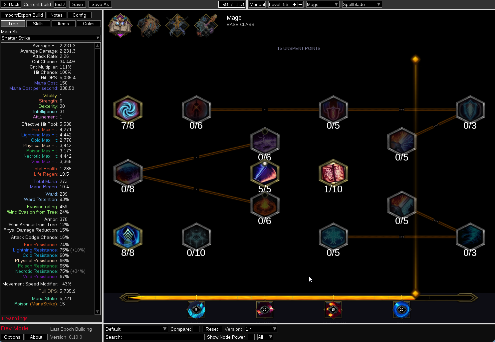
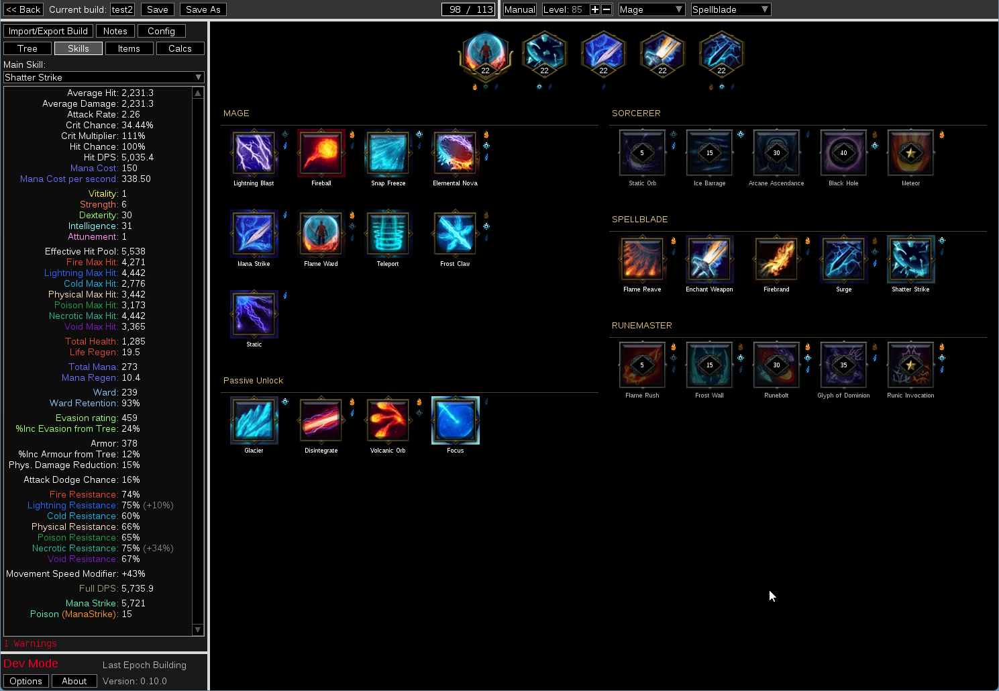
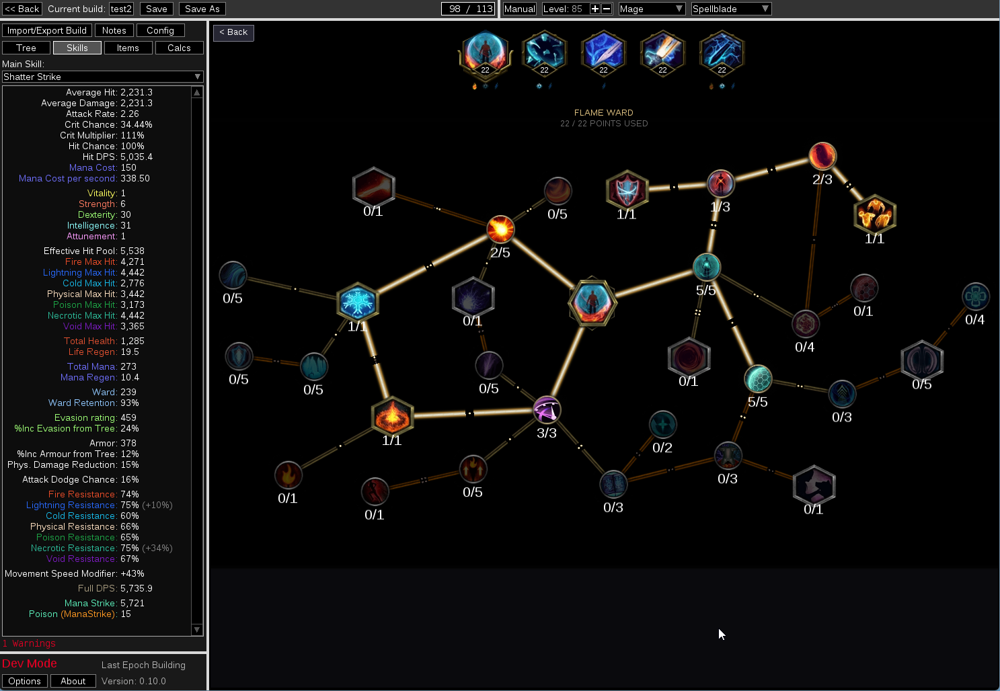
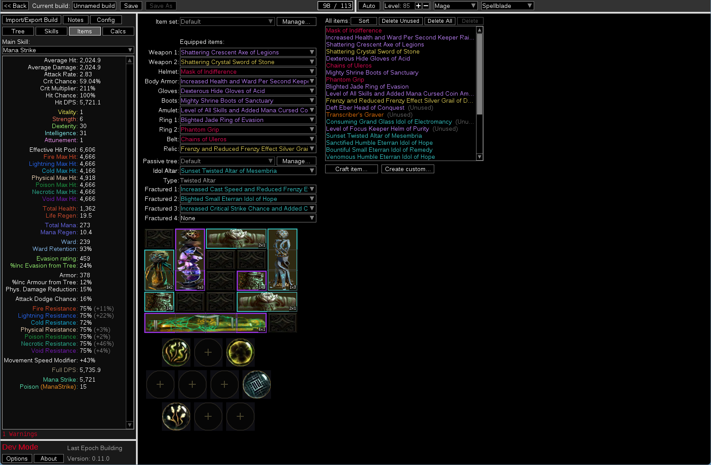
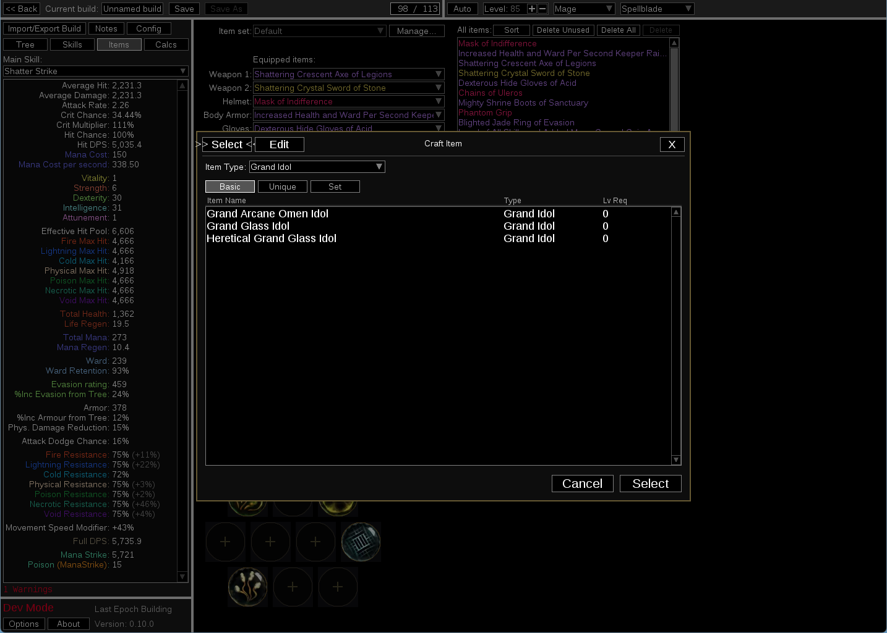
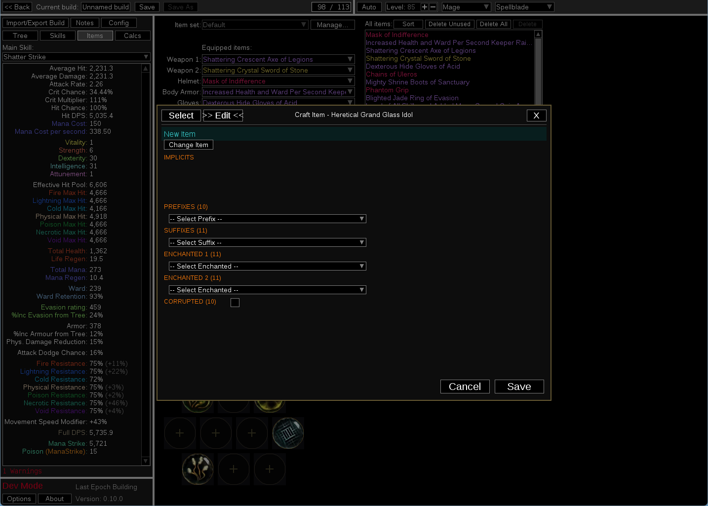
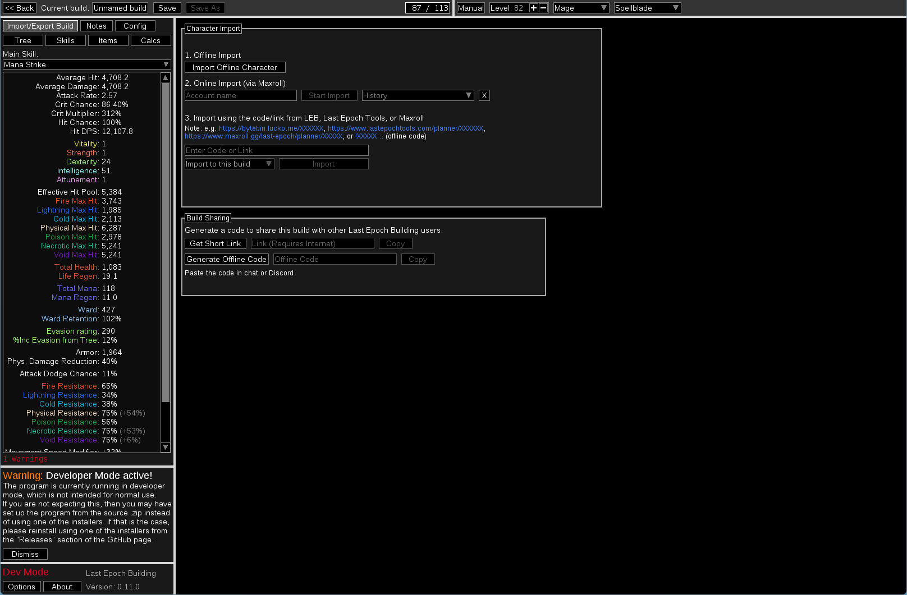

# Last Epoch Building (LEB)

## 🌟 A Path of Building-style offline build planner for **Last Epoch**.

<table>
  <tr>
    <td></td>
    <td></td>
  </tr>
  <tr>
    <td></td>
    <td></td>
  </tr>
  <tr>
    <td></td>
    <td></td>
  </tr>
  <tr>
    <td></td>
  </tr>  
</table>

> Not affiliated with Eleventh Hour Games.
> This is a third-party tool. Any in-game issues are not the responsibility of EHG.

---

## 🤝 Support Development

If you'd like to support LEB's development, consider buying me a coffee!

☕ [Buy Me a Coffee](https://buymeacoffee.com/yobk0831a)
🍵 [Ko-fi](https://ko-fi.com/lastepochbuilding)

Feedback and bug reports are always welcome — see [Contributing](#contributing).

---

## ✨ Features

- **Passive tree** — all classes and masteries
- **Skill trees** — all skills with full node support
- **Equipment simulation** with crafting UI (left/right split layout, card browser)
- **DPS calculation** with ailments, debuffs, and corruption scaling
- **Defense stats** — armor, dodge, block, ward, resistances, endurance
- **Unique & Legendary items**
- **Set items** (Set bonus effect accuracy may vary — see Roadmap)
- **Idols** — Season 4 Idol Altar with crafting system (affix selection, class filtering, Weaver-specific affixes)
- **Blessings** — visual slot UI with icons and hover detail cards
- **Character import** — offline save files and online characters via Maxroll
- **Build sharing** — generate a short link or offline code to share your build
- **Node search** — Ctrl+F in passive tree, skill tree, and skill selection
- **Config tab** — smart buff suggestions when your build can grant Haste, Frenzy, etc.
- **Season 4: Shattered Omens** support

> **Note:** Mod recognition rate is 100% as of LEB v0.12.0. Recognized mods
> are not always calculated with full accuracy — calculator improvements are ongoing.
> Development is focused on Last Epoch Season 4 (LE 1.4).
> Limited support exists for 1.2 and 1.3 builds.

---

## 🚀 Installation

LEB is distributed as a **portable zip — no installation required**.

1. Download `LastEpochBuilding-vX.X.X-win.zip` from the [Releases](../../releases) page
2. Extract the zip to any folder
3. Run **`runtime\Last Epoch Building.exe`**

> **Tip:** You can also double-click `Launch.bat` in the root folder as a shortcut.

User data (builds, settings) is stored alongside the executable, so keep all files in the same folder.

---

## 🛠️ Roadmap

- Improve calculation accuracy across all stats and skills
- Set item bonus effect verification and fixes
- Idol and Idol Altar crafting system
- Auto-populate Config tab from equipped item affixes
  (passive/skill tree detection is live; item affix detection coming)
- Automatic or fast updates when Last Epoch patches release
- Improved support for legacy character import (1.2, 1.3)
- Web version

---

## 🤝 Contributing

Feedback, bug reports, and feature requests are always welcome!

Please see [CONTRIBUTING.md](CONTRIBUTING.md) for details on how to report bugs
and submit pull requests.

---

## 📄 License

[MIT](LICENSE.md) — see LICENSE.md for third-party licenses.

## 💛 Special Thanks

The first few supporters will have their names hidden somewhere in LEB as easter eggs.
Since I have a limited number of good hiding spots in mind, I'll add names in supporter order as new spots come to me.

| Supporter | Note |
|-----------|------|
| WarMachine237 | First ever supporter — a permanent mark in LEB's history |

## 📖 Credits

Based on [Path of Building Community](https://github.com/PathOfBuildingCommunity/PathOfBuilding),
originally forked from [Musholic/LastEpochPlanner](https://github.com/Musholic/LastEpochPlanner).

Development assisted by [Claude Code](https://claude.ai/code) (Anthropic).

## 🛠️ Development Process

See [DEVELOPMENT.md](./DEVELOPMENT.md) for release cadence, testing, and development workflow details.

## 📖 Changelog

Full version history: [CHANGELOG.md](CHANGELOG.md)
