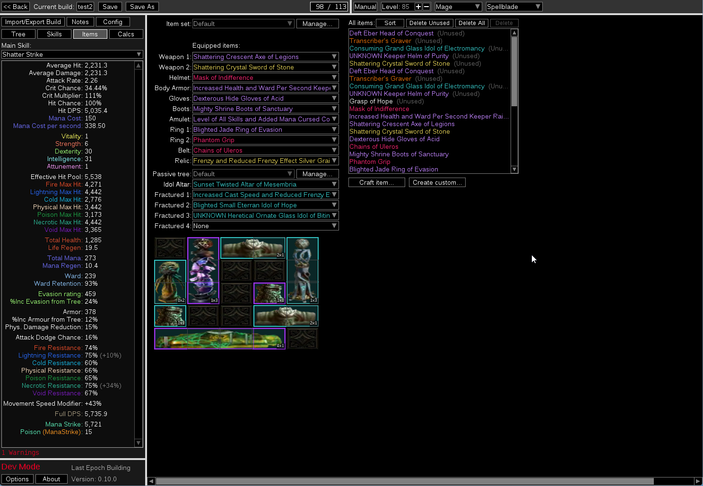

# Last Epoch Building (LEB)

A Path of Building-style offline build planner for **Last Epoch**.
   

> Not affiliated with Eleventh Hour Games.
> This is a third-party tool. Any in-game issues are not the responsibility of EHG.

---

## Support Development

If LEB has helped your builds, consider buying me a coffee!

☕ [Buy Me a Coffee](https://buymeacoffee.com/yobk0831a)

Feedback and bug reports are always welcome — see [Contributing](#contributing).

---

## Features

- **Passive tree** — all classes and masteries
- **Skill trees** — all skills with full node support
- **Equipment simulation** with crafting UI
- **DPS calculation** with ailments and debuffs
- **Defense stats** — armor, dodge, block, ward, resistances
- **Unique & Legendary items**
- **Set items** (Set bonus effect accuracy may vary — see Roadmap)
- **Idols** including Season 4 Idol Altar
- **Blessings** (found in the Config tab)
- **Character import** — offline save files and online characters via LE Tools build planner
- **Season 4: Shattered Omens** support

> **Note:** Mod recognition rate is ~90% (89.7% verified as of v0.10). Recognized mods
> are not always calculated with full accuracy. Development is focused on Last Epoch 1.4.
> Limited support exists for 1.2 and 1.3 builds.

---

## Installation

1. Download the latest release from the [Releases](../../releases) page
2. Extract the zip file
3. Run **`runtime\Last Epoch Building.exe`**

> **Tip:** You can also double-click `Launch.bat` in the root folder as a shortcut.

---

## Roadmap

- Improve calculation accuracy across all stats and skills
- Set item bonus effect verification and fixes
- Idol and Idol Altar crafting system
- Auto-populate Config tab from equipped item affixes
  (e.g. "you have Frenzy" on an item → Frenzy automatically checked in Config)
- Automatic or fast updates when Last Epoch patches release
- Improved support for legacy character import (1.2, 1.3)
- Build sharing (generate a shareable link for your build)
- Web version

---

## Contributing

Feedback, bug reports, and feature requests are always welcome!

Please see [CONTRIBUTING.md](CONTRIBUTING.md) for details on how to report bugs
and submit pull requests.

---

## License

[MIT](LICENSE.md) — see LICENSE.md for third-party licenses.

## Credits

Based on [Path of Building Community](https://github.com/PathOfBuildingCommunity/PathOfBuilding),
originally forked from [Musholic/LastEpochPlanner](https://github.com/Musholic/LastEpochPlanner).

## Changelog

Full version history: [CHANGELOG.md](CHANGELOG.md)
