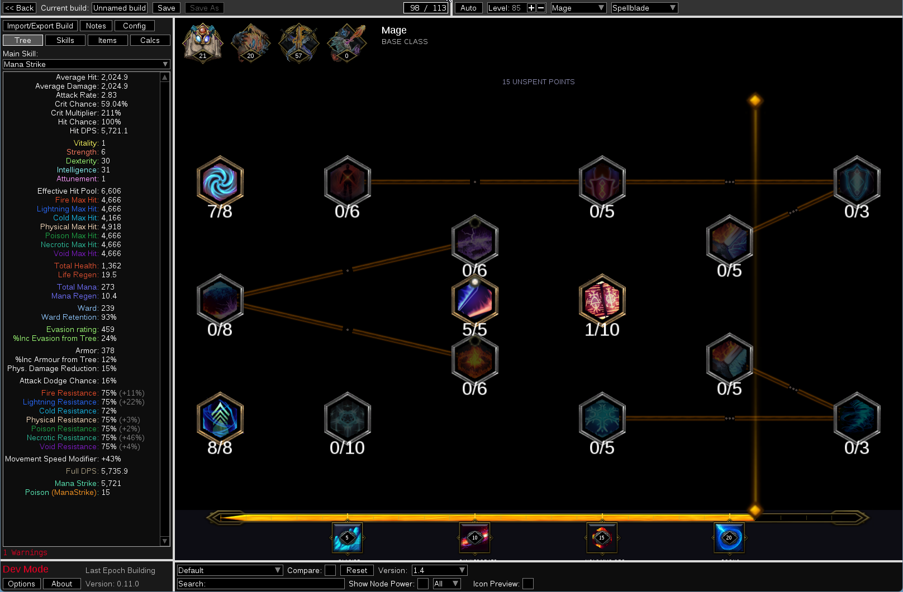
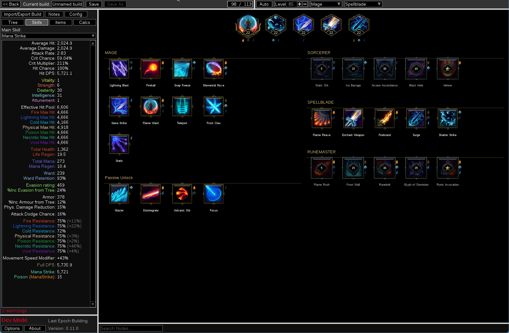
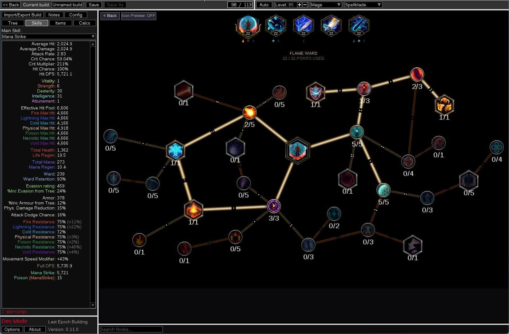
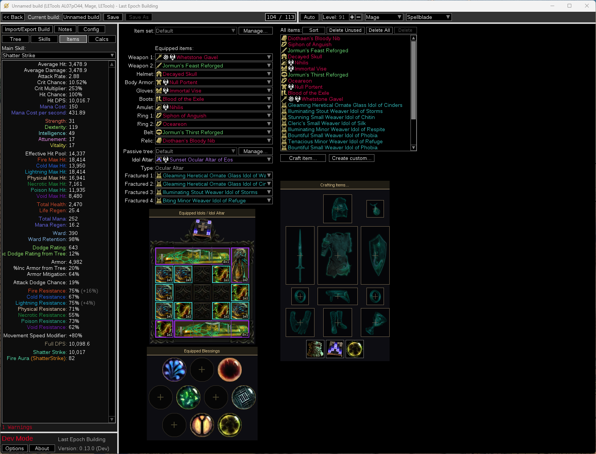
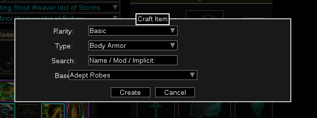
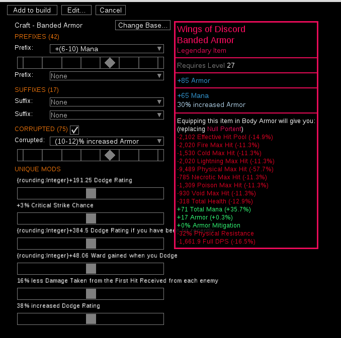
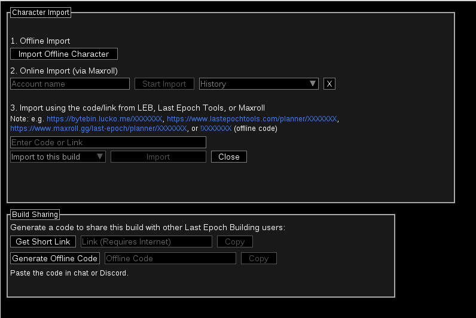
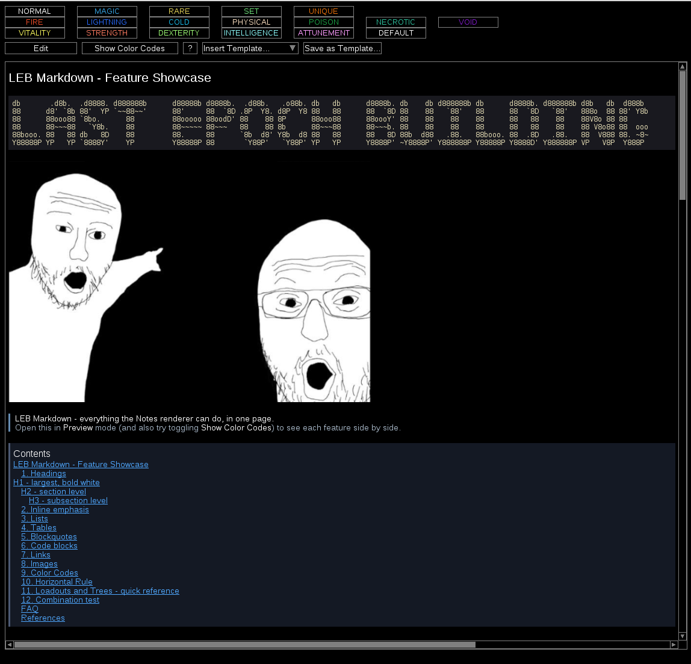

# Last Epoch Building (LEB)

## 🌟 A Path of Building-style offline build planner for **Last Epoch**.

<table>
  <tr>
    <td></td>
    <td></td>
  </tr>
  <tr>
    <td></td>
    <td></td>
  </tr>
  <tr>
    <td></td>
    <td></td>
  </tr>
  <tr>
    <td></td>
    <td></td>
  </tr>  
</table>

> Not affiliated with Eleventh Hour Games.
> This is a third-party tool. Any in-game issues are not the responsibility of EHG.

> **Forking LEB?** You're welcome to — the MIT license permits it.
> Please keep credit to LEB and its upstream ([PoB Community](https://github.com/PathOfBuildingCommunity/PathOfBuilding), [LastEpochPlanner](https://github.com/Musholic/LastEpochPlanner)) visible in your fork's README.

---

## 🔥 What's New in v0.14.0

v0.14.0 is the release where the **damage pipeline came together end-to-end**. Triggered skills, minions, damage conversion, and ailments now flow all the way through to Full DPS — across every class and mastery — the way a Path of Building-style planner is meant to.

Highlights:

- **Trigger-skill engine** — "chance to cast / trigger `<skill>`" affixes, idols, and tree nodes now contribute to Full DPS at a build-derived, rate-capped rate (on hit, on cast, on crit, when-you-use, every N seconds, and more).
- **Minion damage overhaul** — every minion now gets Last Epoch's inherent per-level scaling (builds were roughly 37% low at level 100), plus a new **auto-summon framework** for minions granted by gear, sets, and passives, and multi-ability minions that fold their skills into a single Full DPS number.
- **Game-faithful damage conversion** — skill-scoped base-damage conversion that conserves damage across opposing, cyclic, and multi-hop chains, plus a chance → chance conversion engine.
- **Ailments & damage over time** — over-100% chance overstacking, correct stack caps, resistance/penetration on DoT ticks, minion-applied ailments, and channelled-beam DoTs, with a new **Total DoT DPS** row.
- **Config tab overhaul** — options relevant to your build are auto-highlighted and traced back to the exact node / skill / item, with saveable **Config Sets**.
- **Notes tab with Markdown** — live preview, image embeds, a table of contents, and build-loadout references.

Individually modeled or corrected along the way: a large number of skills, uniques, and minions across all 15 masteries — the full list is in the [Changelog](CHANGELOG.md).

Verified compatible with **Last Epoch 1.4.7**.

---

## 🤝 Support Development

If you'd like to support LEB's development:

💖 [GitHub Sponsors](https://github.com/sponsors/uta666XYZ) — monthly support
☕ [Buy Me a Coffee](https://buymeacoffee.com/yobk0831a) — one-time tip
🍵 [Ko-fi](https://ko-fi.com/lastepochbuilding) — one-time tip

The first few supporters will have their names hidden somewhere in LEB as easter eggs.
Since I have a limited number of good hiding spots in mind, I'll add names in supporter order as new spots come to me.

Feedback and bug reports are always welcome — see [Contributing](#contributing).

---

## ✨ Features

- **Passive tree** — all classes and masteries
- **Skill trees** — all skills with full node support
- **Equipment simulation** with crafting UI (left/right split layout, card browser)
- **DPS calculation** — hits, triggered skills, minions, damage conversion, and ailments all flow into a single Full DPS figure, with corruption scaling
- **Defense stats** — armor, dodge, block, ward, resistances, endurance
- **Unique & Legendary items**
- **Set items** (Set bonus effect accuracy may vary — see Roadmap)
- **Idols** — Season 4 Idol Altar with crafting system (affix selection, class filtering, Weaver-specific affixes)
- **Blessings** — visual slot UI with icons and hover detail cards
- **Character import** — offline save files and online characters via Maxroll
- **Build sharing** — generate a short link or offline code to share your build
- **Node search** — Ctrl+F in passive tree, skill tree, and skill selection
- **Config tab** — build-aware highlighting of the settings that matter for your build (buffs, stacks, enemy states), traced to their source, with saveable Config Sets
- **Notes tab** — Markdown notes with live preview, image embeds, a table of contents, and build-loadout references
- **Steps (Leveling Order)** — record the order in which you allocate passive and skill tree nodes, then toggle **All / Min** display to read back the leveling path (LEB-only feature; useful for build creators sharing leveling guides without writing them out in Notes)
- **Season 4: Shattered Omens** support

> **Note:** Mod recognition has been at 100% since v0.12.0. As of **v0.14.0**, the
> calculation engine models the full damage pipeline — hits, triggers, minions,
> conversions, and ailments — end-to-end into Full DPS. Accuracy is verified against
> community reference builds on an ongoing basis, and some skills are still being
> calibrated. LEB's stat calculations were also cross-checked against
> **over 500 community-shared builds per mastery** to surface systematic discrepancies.
> See [docs/SKILL_STATUS.md](docs/SKILL_STATUS.md) for which skills have been verified and
> which still need validation.
> Development is focused on Last Epoch Season 4 (LE 1.4), and LEB is verified
> compatible with the current **1.4.7** game version. Limited support exists for
> 1.2 and 1.3 builds.

---

## 🚀 Installation

LEB is distributed as a **portable zip — no installation required**.

1. Download `LastEpochBuilding-vX.X.X-win.zip` from the [Releases](../../releases) page
2. Extract the zip to any folder
3. Run **`runtime\Last Epoch Building.exe`**

> **Tip:** You can also double-click `Launch.bat` in the root folder as a shortcut.

User data (builds, settings) is stored alongside the executable, so keep all files in the same folder.

### 🐧 Running on Linux (via Wine)

LEB is currently distributed as a Windows build only. A native Linux build is **not** available, but LEB runs well on Linux through [Wine](https://www.winehq.org/) (community-tested; not officially supported).

1. Install Wine (e.g. `sudo apt install wine` on Debian/Ubuntu, `sudo pacman -S wine` on Arch)
2. Extract `LastEpochBuilding-vX.X.X-win.zip` to any folder
3. From the extracted folder, run:
   ```sh
   wine "runtime/Last Epoch Building.exe"
   ```

- **Wayland users:** if the window opens but renders black, try
  `GDK_BACKEND=x11 wine "runtime/Last Epoch Building.exe"`

Tested with recent Wine versions; if you hit issues, please open an issue with your distro and Wine version. A native Linux/Web build is on the [Roadmap](#-roadmap).

---

## 🛠️ Roadmap

- Improve calculation accuracy across all stats and skills
- Improve the accuracy of auto-highlighted Config-tab options detected from your passive tree, skill trees, and equipped item affixes (detection is live; coverage and precision are still being refined)
- Automatic or fast updates when Last Epoch patches release
- Web version

---

## 🤝 Contributing

Feedback, bug reports, and feature requests are always welcome!

Please see [CONTRIBUTING.md](CONTRIBUTING.md) for details on how to report bugs
and submit pull requests.

## 🛠️ Development Process

See [DEVELOPMENT.md](./DEVELOPMENT.md) for release cadence, testing, and development workflow details.

## 📖 Changelog

Full version history: [CHANGELOG.md](CHANGELOG.md)

## 📖 Credits

Based on [Path of Building Community](https://github.com/PathOfBuildingCommunity/PathOfBuilding),
originally forked from [Musholic/LastEpochPlanner](https://github.com/Musholic/LastEpochPlanner).

Development assisted by [Claude Code](https://claude.ai/code) (Anthropic).

## 💛 Special Thanks

### ☕ Supporters (Buy Me a Coffee)

| Supporter        | Note                                                     |
| ---------------- | -------------------------------------------------------- |
| 👑 WarMachine237 | First ever supporter — a permanent mark in LEB's history |

### 💬 Community Feedback

**v0.14**

- u/Skoopy_590 (thanks for the nudge to take a fresh look at LEB's quality-of-life)
- u/Niistokeppi (thanks for reminding me I'd forgotten to implement ailments — Bleed included)
- u/dugfin (thanks for the heads-up about the API)
- R Markdown (https://rmarkdown.rstudio.com/) — the inspiration to bring Markdown to the Notes tab

**v0.13**

- 🏆 **Test Build MVP — u/SottoSopra666** — one person, five builds; single-handedly broke the Blessing system, the Crit calc, and made me question every Resist value (see CHANGELOG for the full story)
- u/ratonbox, u/Bassndy, and u/Mr-Nabokov (thanks for sharing your builds)
- u/pro185, and u/MRosvall (thanks for contributing ideas for the Steps feature)
- u/berethon (thanks for contributing ideas for idol/blessing comparison feature)

---

## 📄 License

[MIT](LICENSE.md) — see LICENSE.md for third-party licenses.
